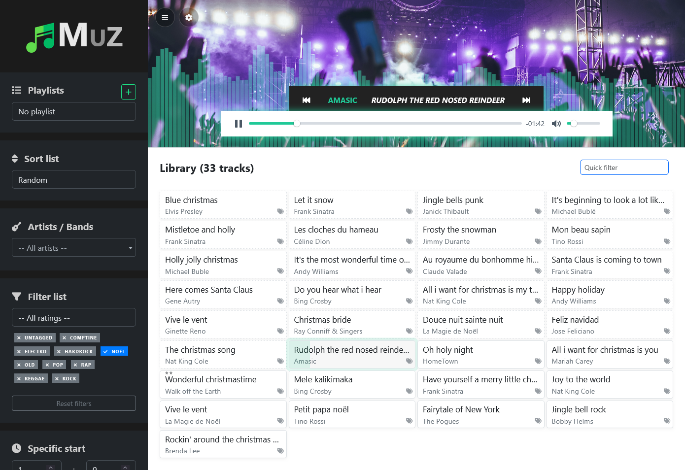

# Muz

Self-hosted web music library. Muz indexes your MP3s, lets you filter/search fast, manage playlists, and play music in a modern player.

## Requirements

To run Muz, you need:

- PHP 8.0+ with the following extensions enabled:
  - pdo_sqlite (SQLite via PDO)
  - iconv (used for filename slugification)
  - gd with WebP support (image conversion to WebP)
  - fileinfo (recommended, for MIME detection)
- A web server pointing to the `public/` directory as the document root (Apache, Nginx, or PHP built-in server)
- Write permissions on these folders:
  - `db/` (SQLite database file)
  - `public/music/` (your MP3 library)
  - `public/img/gp/` (player background images)

## About

Muz is a simple-to-deploy PHP/JS app that offers:
- automatic import of MP3 files from configured folders
- metadata editing (artist/title), rating, and tags
- fast filters (tags, untagged, rating, artist), sorting (alphabetical, recent, random)
- instant client-side search
- playlist management (create, rename, duplicate, delete, add/remove tracks)
- modern audio player with previous/next shortcuts, resume, and custom start position
- translated UI (multi-language) and clean themes with Bootstrap

## Features

- File and database management
  - Automatic import of new MP3s on load
  - Cleanup of orphaned tags
  - Export/Import database via the “DB & Files” modal
  - Drag-and-drop upload (MP3 and images png/jpg/webp)
  - Store MP3s in `public/music/` and images in `public/img/gp/`
  - Automatic image conversion to WebP (when possible) and slugified naming
- Audio playback
  - Plyr-based player (play/pause, seekbar, volume, mute)
  - Previous/Next navigation
  - Start at a specific time (persists until disabled)
  - Player background images (chosen or random)
  - Scrolling song title in tab (lightweight animation)
  - Optional audio visualizer overlay (Web Audio API)
- Library and navigation
  - Grid sorting: alphabetical, recent additions, random
  - Instant client-side filters:
    - Tags (include/exclude) with consistent icons (✓ for include, ✗ for exclude)
    - “Untagged” button with persistence
    - Rating (0–5 stars)
    - Artist (searchable select)
  - Filter persistence (localStorage) and “Reset” button
  - Dynamic track counter based on filters
  - Quick search (title/artist) with localized messages
- Playlists
  - Create, rename, duplicate, delete
  - Add/remove a song to a playlist from a dedicated modal
  - Prepare a copy of a playlist (to easily retrieve MP3s) — also resets ID3 tags (title and group)
  - Track count display
- Song management
  - Rename (artist/title)
  - Rate (1–5)
  - Add/Remove tags (suggestions, datalist)
  - Delete MP3 (file + database)
  - Visual “has tags” indicator on each tile
- Lightweight audio visualizer overlay that renders frequency bars over the player area.
  - Placement: Rendered between the background image and the player UI; hidden when nothing is playing
  - Toggle: Controlled by `conf.ini`
  - Performance: Efficient Canvas 2D rendering with devicePixelRatio scaling
  - Compatibility: Uses the Web Audio API (modern browsers); the app works fine if the visualizer is disabled
- Internationalization (i18n)
  - Language loaded from `conf.ini` ([app].lang)
  - Dynamic language selector (scans `lang/*.php`) with name and flag
  - Expose strings to client (window.i18n) for UI/JS messages
  - Localized Select2 and quick search
  - Available languages (quality varies per file):
    - French (fr), English (en), Spanish (es), Italian (it), German (de), Dutch (nl), Polish (pl), Portuguese (pt), Ukrainian (uk), Chinese (zh), Japanese (ja), Esperanto (eo)
- Misc
  - Responsive UI (Bootstrap 5)
  - PWA (manifest + basic pwa.js)
  - Collapsible sidebar (state remembered)

## Notes
- Plyr initialization is centralized; playback now only iterates over visible tracks after filtering/search.
- Music/image paths and the app URL are configured in `conf.ini`.
- To enable the audio visualizer, set `[player] visualizer = 1` in `conf.ini`.
- If your server doesn’t serve `public/` as the web root, ensure static assets (CSS/JS) are reachable according to `conf.ini` `app.url`.
- Opacity and layering are designed so the bars stay below the player controls and above the background.

## Libraries and tools

- Frontend
  - Bootstrap 5.3 (bundle with Popper)
  - jQuery 3.7.1
  - Select2 4.0.x
  - Plyr (audio player)
  - Font Awesome (icons)
- Backend
  - PHP 8+
  - SQLite (via Song/Tag/Playlist models)
- Misc
  - Minimal PWA manifest
